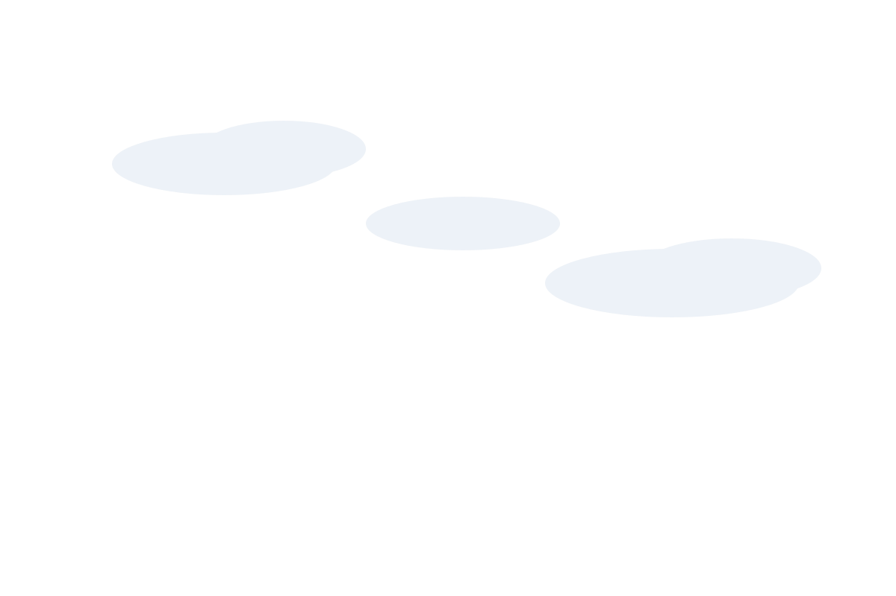

# En la lucha — SVG animation

A calm, elegant animation built from layered SVG illustrations.
No build tools, no npm, no server needed.

## How to run it

**Just double-click `index.html`** — it opens in your web browser and runs. That's it.

## What it does

- Each SVG sits in its own **layer**, stacked back-to-front.
- On load, the layers **fade up** into place, one after another.
- They gently **float** up and down forever (a slow "breath").
- As you move your **mouse**, the layers **drift** at different speeds
  (parallax), which gives a soft sense of depth.

## Use your own illustrations

1. Put your `.svg` file(s) into the **`svg/`** folder.
2. Open **`index.html`** in a text editor and find the section marked
   `THE SCENE`. Each illustration is one block like this:

   ```html
   <div class="layer" data-depth="1.4">
     
   </div>
   ```

   - Change `svg/clouds.svg` to your own filename.
   - `data-depth` controls how much it moves with the mouse
     (`0` = still, higher = more movement).
   - Copy/paste a block to add a layer, or delete one to remove it.
   - Order matters: the **first** block is the **furthest back**.

## Change the colors or speed

Open `index.html` and look at the top of the `<style>` block:

```css
--sky-top:    #2a3550;   /* background gradient, top    */
--sky-bottom: #6d7f9e;   /* background gradient, bottom */
--parallax:   18px;      /* how far layers drift        */
```

The placeholder art (`svg/sky.svg`, `svg/clouds.svg`, `svg/hills-back.svg`,
`svg/hills-front.svg`) is just a starting point — replace it with yours whenever
you're ready.
